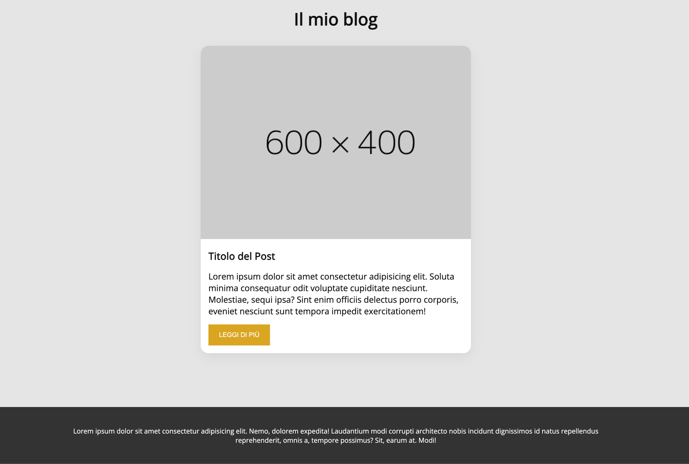

<h1 align="center">
  
  react-context-auth
  
</h1>

<!-- <h4 align="center">summary <a href="http://electron.atom.io" target="_blank">"link"</a>.</h4> -->

<!-- <p align="center">
  <a href="https://badge.fury.io/js/electron-markdownify">
    
  </a>
  <a href="https://gitter.im/amitmerchant1990/electron-markdownify"></a>
  <a href="https://saythanks.io/to/bullredeyes@gmail.com">
      
  </a>
  <a href="https://www.paypal.me/AmitMerchant">
    
  </a>
</p> -->

<p align="center">
  <a href="#description">Description</a> •
  <a href="#how-to-use">How To Use</a> •
  <a href="#used-technologies">Used technologies</a> 
</p>

<!--  -->

## Description

Partendo dall’esercizio precedente iniziamo ad aggiungere l’area amministrativa al nostro blog

- Creiamo un context per gestire e trasmettere le informazioni di autenticazione.
- Creiamo un middleware per proteggere l’area privata.
- Creiamo una pagina con un form al suo interno che simuli il login dell’utente.

### BONUS

- Aggiungere un bottone per permettere all’utente di effettuare il logout.
- Implementate una logica per salvare lo stato di login quando la pagina viene ricaricata (custom hook).

## How To Use

To clone and run this application, you'll need [Git](https://git-scm.com) and [Node.js](https://nodejs.org/en/download/) (which comes with [npm](http://npmjs.com)) installed on your computer. From your command line:

```bash
# Clone this repository
 git clone ('link of the repository')

# Go into the repository
 cd ('file name') or cd .

# Install dependencies
 npm install

# Run the app
 npm run dev
```

## Used technologies

This software uses the following technologies:

- [Node.js](https://)
- [Express](https://)

> GitHub [@JohnQuimson](https://github.com/JohnQuimson) &nbsp;&middot;&nbsp;
> Twitter [@John Henric Quimson](https://www.linkedin.com/in/john-henric-quimson-973827280/)
